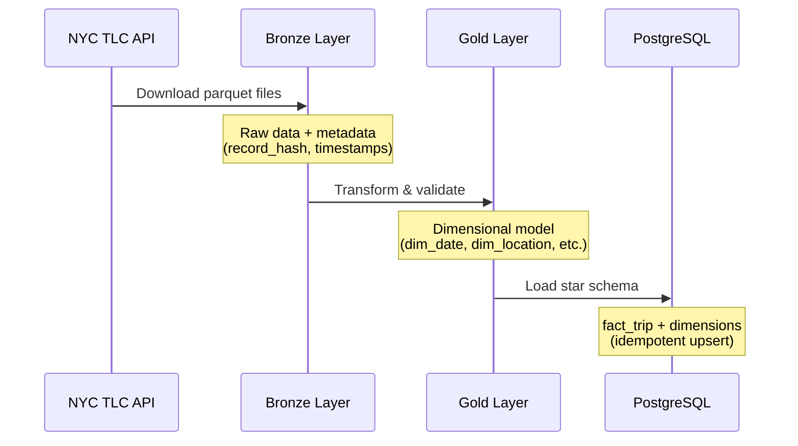

[](https://github.com/arturogonzalezm/nyc-taxi-pipeline/actions/workflows/ci.yml)
[](https://codecov.io/gh/arturogonzalezm/nyc-taxi-pipeline)
[](https://github.com/psf/black)
[](https://flake8.pycqa.org/)
[](https://pylint.pycqa.org/)

# NYC Taxi Data Pipeline

A PySpark-based ETL pipeline for processing NYC Taxi & Limousine Commission (TLC) trip data. The pipeline implements a medallion architecture (Bronze/Gold layers) with a dimensional model loaded into PostgreSQL.

## Table of Contents

- [Architecture](#architecture)
- [Prerequisites](#prerequisites)
- [Quick Start](#quick-start)
- [Running the Pipeline](#running-the-pipeline)
- [Makefile Commands](#makefile-commands)
- [Project Structure](#project-structure)
- [Data Model](#data-model)
- [Testing](#testing)
- [Documentation](#documentation)

## Architecture

The pipeline follows a medallion architecture with three layers:



### Layer Overview

| Layer | Purpose | Storage |
|-------|---------|---------|
| Bronze | Raw data ingestion with metadata columns | MinIO (S3-compatible) |
| Gold | Dimensional model with data quality checks | MinIO (S3-compatible) |
| Load | Star schema for analytics | PostgreSQL |

## Prerequisites

- Python 3.10+
- Docker Desktop (for MinIO and PostgreSQL)
- Java 11+ (for PySpark)

## Quick Start

### 1. Clone and Setup

```bash
git clone https://github.com/arturogonzalezm/nyc-taxi-pipeline
cd nyc-taxi-pipeline

# Create virtual environment
python -m venv .venv
source .venv/bin/activate  # On Windows: .venv\Scripts\activate

# Install dependencies
pip install ".[dev]"

# Initialize environment
make init
```

### 2. Start Services

```bash
# Start MinIO and PostgreSQL
make up
```

Services available:
- MinIO API: http://localhost:9000
- MinIO Console: http://localhost:9001
- PostgreSQL: localhost:5432

### 3. Run the Pipeline

```bash
# Ingest a single month of yellow taxi data
python -m etl.jobs.bronze.taxi_ingestion_job --taxi-type yellow --year 2024 --month 1

# Transform to dimensional model
python -m etl.jobs.gold.taxi_gold_job --taxi-type yellow --year 2024 --month 1

# Load to PostgreSQL
python -m etl.jobs.load.postgres_load_job --taxi-type yellow --year 2024 --month 1
```

### 4. Query the Data

```bash
# Connect to PostgreSQL
make postgres-shell

# Sample queries
SELECT COUNT(*) FROM taxi.fact_trip;
SELECT * FROM taxi.dim_location LIMIT 10;
```

### 5. Stop Services

```bash
make down
```

## Running the Pipeline

### Bronze Layer (Ingestion)

Downloads raw parquet files from NYC TLC and stores them in MinIO with metadata columns.

```bash
# Single month
python -m etl.jobs.bronze.taxi_ingestion_job \
    --taxi-type yellow \
    --year 2024 \
    --month 1

# Bulk ingestion (date range)
python -m etl.jobs.bronze.taxi_ingestion_job \
    --taxi-type yellow \
    --start-year 2023 --start-month 1 \
    --end-year 2023 --end-month 12

# Green taxi data
python -m etl.jobs.bronze.taxi_ingestion_job \
    --taxi-type green \
    --year 2024 \
    --month 1
```

### Zone Lookup (Reference Data)

Ingests the taxi zone lookup CSV for location dimension.

```bash
python -m etl.jobs.bronze.zone_lookup_ingestion_job
```

### Gold Layer (Transformation)

Transforms bronze data into a dimensional model with data quality checks.

```bash
# Single month
python -m etl.jobs.gold.taxi_gold_job \
    --taxi-type yellow \
    --year 2024 \
    --month 1

# Date range
python -m etl.jobs.gold.taxi_gold_job \
    --taxi-type yellow \
    --year 2023 --month 1 \
    --end-year 2023 --end-month 6
```

### Load Layer (PostgreSQL)

Loads the dimensional model into PostgreSQL using idempotent upserts.

```bash
# Load all data for a taxi type
python -m etl.jobs.load.postgres_load_job --taxi-type yellow

# Load specific month
python -m etl.jobs.load.postgres_load_job \
    --taxi-type yellow \
    --year 2024 \
    --month 1
```

### Safe Backfill

For re-processing historical data without duplicates:

```bash
# Backfill specific months
python etl/jobs/bronze/taxi_injection_safe_backfill_job.py yellow 2023-03 2023-07

# Backfill a range
python etl/jobs/bronze/taxi_injection_safe_backfill_job.py yellow 2023-01:2023-12

# Skip deletion (keep existing data)
python etl/jobs/bronze/taxi_injection_safe_backfill_job.py yellow 2024-01 --no-delete
```

## Makefile Commands

### General

| Command | Description |
|---------|-------------|
| `make init` | Initialize directories and create `.env` from template |
| `make up` | Start all services (MinIO + PostgreSQL) |
| `make down` | Stop all services |
| `make logs` | Show service logs |
| `make nuke` | Remove all containers, images, and volumes |

### PostgreSQL

| Command | Description |
|---------|-------------|
| `make postgres-start` | Start PostgreSQL container |
| `make postgres-stop` | Stop PostgreSQL container |
| `make postgres-shell` | Connect to PostgreSQL shell |
| `make postgres-status` | Show PostgreSQL status and table counts |
| `make postgres-create-tables` | Create dimensional model tables |
| `make postgres-nuke` | Destroy and recreate PostgreSQL with fresh schema |

### Help

```bash
make help
```

## Project Structure

```
nyc-taxi-pipeline/
├── etl/
│   ├── jobs/
│   │   ├── base_job.py              # Abstract base class (Template Method pattern)
│   │   ├── bronze/
│   │   │   ├── taxi_ingestion_job.py           # NYC taxi data ingestion
│   │   │   ├── taxi_injection_safe_backfill_job.py  # Safe historical backfill
│   │   │   └── zone_lookup_ingestion_job.py    # Zone lookup reference data
│   │   ├── gold/
│   │   │   └── taxi_gold_job.py     # Dimensional model transformation
│   │   ├── load/
│   │   │   └── postgres_load_job.py # PostgreSQL loader
│   │   └── utils/
│   │       ├── config.py            # Configuration (Singleton pattern)
│   │       └── spark_manager.py     # Spark session management
│   └── __init__.py
├── tests/                           # Unit tests (345 tests, 74% coverage)
├── sql/
│   └── postgres/
│       └── create_dimensional_model.sql  # PostgreSQL schema DDL
├── docs/                            # Additional documentation
├── docker-compose.yml               # MinIO and PostgreSQL services
├── Makefile                         # Build automation
├── pyproject.toml                   # Project configuration and dependencies
└── README.md
```

## Data Model

### Star Schema

The gold layer produces a star schema with the following tables:

```
                    +---------------+
                    |   dim_date    |
                    +---------------+
                    | date_key (PK) |
                    | date          |
                    | year          |
                    | month         |
                    | day_of_week   |
                    | is_weekend    |
                    +-------+-------+
                            |
+---------------+           |           +---------------+
| dim_location  |           |           |  dim_payment  |
+---------------+           |           +---------------+
| location_key  |           |           | payment_key   |
| borough       |           |           | payment_type  |
| zone          |           |           | payment_desc  |
| service_zone  |           |           +-------+-------+
+-------+-------+           |                   |
        |                   |                   |
        |           +-------+-------+           |
        +---------->|   fact_trip   |<----------+
                    +---------------+
                    | trip_key (PK) |
                    | date_key (FK) |
                    | pickup_location_key (FK)  |
                    | dropoff_location_key (FK) |
                    | payment_key (FK)          |
                    | passenger_count           |
                    | trip_distance             |
                    | fare_amount               |
                    | total_amount              |
                    | fact_hash (unique)        |
                    +---------------+
```

### Idempotent Loading

The PostgreSQL loader uses hash-based upserts to ensure idempotency:
- Each fact record has a `fact_hash` computed from business keys
- Re-running the load job skips existing records
- Safe to run multiple times without creating duplicates

## Testing

```bash
# Run all tests
pytest tests/ -v

# Run with coverage
pytest tests/ -v --cov=etl --cov-report=term

# Run specific test file
pytest tests/test_base_job.py -v
```

### Code Quality

```bash
# Format code
black etl/ tests/

# Lint
flake8 etl/ --max-line-length=100 --ignore=E501,W503
pylint etl/
```

## Documentation

Additional documentation is available in the `docs/` directory:

| Document | Description |
|----------|-------------|
| [QUICK_START.md](docs/QUICK_START.md) | Quick reference guide |
| [PROJECT_STRUCTURE.md](docs/PROJECT_STRUCTURE.md) | Detailed project structure |
| [HISTORICAL_INGESTION_GUIDE.md](docs/HISTORICAL_INGESTION_GUIDE.md) | Complete ingestion guide |
| [GOLD_LAYER_DIMENSIONAL_MODEL.md](docs/GOLD_LAYER_DIMENSIONAL_MODEL.md) | Dimensional model details |
| [LOAD_LAYER_GUIDE.md](docs/LOAD_LAYER_GUIDE.md) | PostgreSQL loading guide |
| [POSTGRES_MAKEFILE_GUIDE.md](docs/POSTGRES_MAKEFILE_GUIDE.md) | PostgreSQL Makefile commands |
| [DOCKER_CLEANUP_GUIDE.md](docs/DOCKER_CLEANUP_GUIDE.md) | Docker cleanup instructions |

## Environment Variables

Configure via `.env` file (created from `.env.example` by `make init`):

| Variable | Default | Description |
|----------|---------|-------------|
| `MINIO_ENDPOINT` | `localhost:9000` | MinIO server endpoint |
| `MINIO_ACCESS_KEY` | `minioadmin` | MinIO access key |
| `MINIO_SECRET_KEY` | `minioadmin` | MinIO secret key |
| `MINIO_BUCKET` | `nyc-taxi-pipeline` | MinIO bucket name |
| `POSTGRES_HOST` | `localhost` | PostgreSQL host |
| `POSTGRES_PORT` | `5432` | PostgreSQL port |
| `POSTGRES_DB` | `nyc_taxi` | PostgreSQL database |
| `POSTGRES_USER` | `postgres` | PostgreSQL user |
| `POSTGRES_PASSWORD` | `postgres` | PostgreSQL password |

## License

MIT License
