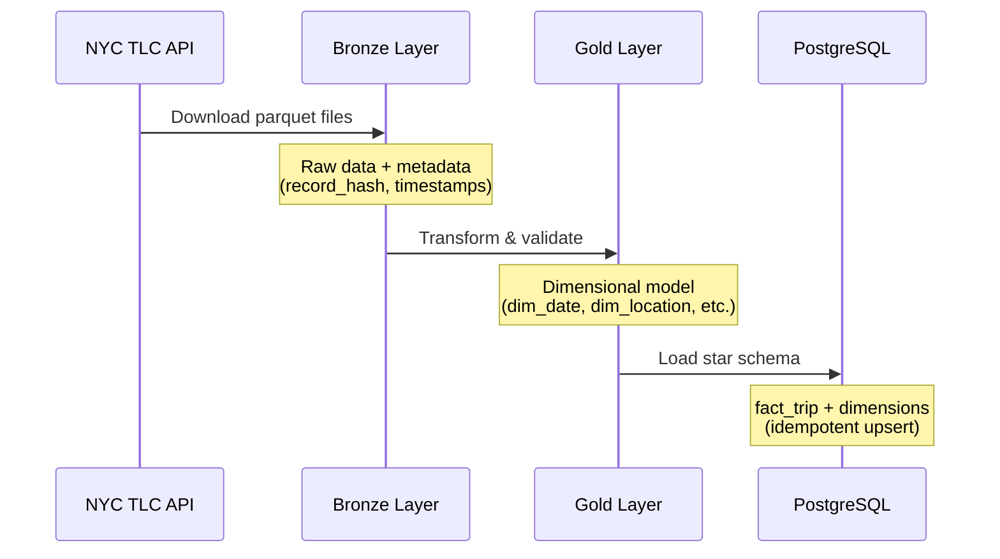

# Architecture

## Overview

The NYC Taxi Pipeline implements a **medallion architecture** with three layers: Bronze, Gold, and Load. Data flows from the NYC TLC API through transformation stages into a PostgreSQL data warehouse.

## Architecture Diagram

```
┌─────────────────────────────────────────────────────────────────────────────────┐
│                           NYC Taxi Data Pipeline                                │
└─────────────────────────────────────────────────────────────────────────────────┘

┌──────────────┐     ┌──────────────────────────────────────────────────────────┐
│   NYC TLC    │     │                      MinIO (S3)                          │
│     API      │     │  ┌─────────────────┐      ┌─────────────────┐            │
│              │────▶│  │  Bronze Layer   │─────▶│   Gold Layer    │            │
│  (Parquet)   │     │  │   (Raw Data)    │      │ (Dimensional)   │            │
└──────────────┘     │  └─────────────────┘      └─────────────────┘            │
                     └──────────────────────────────────────────────────────────┘
                                                          │
                                                          ▼
                     ┌──────────────────────────────────────────────────────────┐
                     │                     PostgreSQL                           │
                     │  ┌─────────────────────────────────────────────────────┐ │
                     │  │                   Load Layer                        │ │
                     │  │  ┌──────────┐ ┌──────────┐ ┌──────────┐            │ │
                     │  │  │ dim_date │ │dim_location│ │dim_payment│           │ │
                     │  │  └──────────┘ └──────────┘ └──────────┘            │ │
                     │  │              ┌──────────────┐                       │ │
                     │  │              │  fact_trip   │                       │ │
                     │  │              └──────────────┘                       │ │
                     │  └─────────────────────────────────────────────────────┘ │
                     └──────────────────────────────────────────────────────────┘
```

## Sequence Diagram



## Layer Details

### Bronze Layer (Raw Ingestion)

| Aspect | Description |
|--------|-------------|
| **Purpose** | Ingest raw data with minimal transformation |
| **Storage** | MinIO (S3-compatible object storage) |
| **Format** | Parquet with Snappy compression |
| **Metadata** | `record_hash`, `ingestion_timestamp`, `source_file` |
| **Partitioning** | By `taxi_type`, `year`, `month` |

### Gold Layer (Dimensional Model)

| Aspect | Description |
|--------|-------------|
| **Purpose** | Transform raw data into analytics-ready dimensional model |
| **Storage** | MinIO (S3-compatible object storage) |
| **Format** | Parquet with Snappy compression |
| **Tables** | `dim_date`, `dim_location`, `dim_payment`, `fact_trip` |
| **Quality Checks** | Null validation, range checks, referential integrity |

### Load Layer (Data Warehouse)

| Aspect | Description |
|--------|-------------|
| **Purpose** | Serve data for analytics and reporting |
| **Storage** | PostgreSQL |
| **Schema** | Star schema with fact and dimension tables |
| **Load Strategy** | Idempotent upserts (INSERT ON CONFLICT) |
| **Indexing** | Optimized for common query patterns |

## Technology Stack

| Component | Technology | Purpose |
|-----------|------------|---------|
| **Processing** | PySpark 4.1.1 | Distributed data processing |
| **Object Storage** | MinIO | S3-compatible storage for Bronze/Gold layers |
| **Data Warehouse** | PostgreSQL 15 | Analytics database |
| **Containerization** | Docker Compose | Local development environment |
| **Orchestration** | Makefile | Task automation |

## Data Flow

1. **Ingestion**: Raw parquet files downloaded from NYC TLC API
2. **Bronze**: Data stored with metadata columns for lineage tracking
3. **Transformation**: Data cleansed, validated, and modeled into star schema
4. **Gold**: Dimensional model stored in MinIO
5. **Load**: Data loaded into PostgreSQL with idempotent upserts
